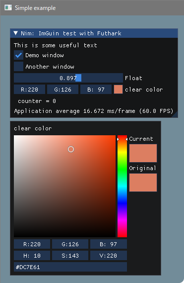
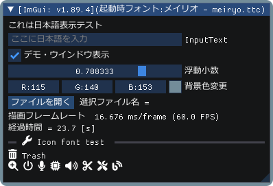

<!-- START doctoc generated TOC please keep comment here to allow auto update -->
<!-- DON'T EDIT THIS SECTION, INSTEAD RE-RUN doctoc TO UPDATE -->

- [ImGuin](#imguin)
  - [Usage: Sample program and run](#usage-sample-program-and-run)
    - [Prerequisite](#prerequisite)
    - [Build](#build)
    - [Screen shot](#screen-shot)
  - [Update latest Dear ImGui and CImGui](#update-latest-dear-imgui-and-cimgui)
    - [Prerequisite](#prerequisite-1)
    - [Update ImGui/CImGui](#update-imguicimgui)
  - [Examples notice](#examples-notice)
    - [TODO](#todo)
    - [My tools version](#my-tools-version)
    - [Other link](#other-link)

<!-- END doctoc generated TOC please keep comment here to allow auto update -->

# ImGuin 

[Dear Imgui](https://github.com/ocornut/imgui) wrapper using [CImGui](https://github.com/cimgui/cimgui) and [Futhark](https://github.com/PMunch/futhark) with Nim language.

**Under construction at this moment**

## Usage: Sample program and run

---

### Prerequisite

---
1. Nim-1.6.10 or later
1. Add libraries

   ```sh
   nimble install glfw nimgl sdl2_nim
   ```

1. For Linux Debian 11 Bullseye

      ```sh
      $ sudo apt install xorg-dev libopengl-dev ibgl1-mesa-glx libgl1-mesa-dev
      ```
      
      and for glfw3

      ```sh
      $ sudo apt install libglfw3 libglfw3-dev
      ```
      and for sdl2

      ```sh
      $ sudo apt install libsdl2-dev
      ```

### Build  

---

1. First clone this project,

   ```sh
   git clone --recursive https://github.com/dinau/imguin
   ```

1. Sample program is here, [examples](examples).  
For instance, [imguin_glfw_opengl3.nim](examples/glfw_opengl3/imguin_glfw_opengl3.nim):

   ```sh
   cd imguin/examples/glfw_opengl3
   make
   ```

   After build, run `./imguin_glfw_opengl3(.exe)`.

1. For static link, read this [examples/README.md](examples/README.md). 

### Screen shot

---

These are screen shots on Windows10.  

[glfw_opengl3](examples/glfw_opengl3).  


[glfw_opengl3_nimgl_imguin_jp](examples/glfw_opengl3_nimgl_imguin_jp).  


## Update latest Dear ImGui and CImGui

### Prerequisite

---

1. [Git](https://git-scm.com/) installed.
1. Windows10 or later  
Clang/LLVM refer to [Futhark installation](https://github.com/PMunch/futhark#installation).

   ```sh
   nimble install futhark 
   ```

1. Linux Debian 11 Bullseye

    ```sh
    sudo apt install  libclang-dev
    nimble install --passL:"-L/usr/lib/llvm-11/lib" futhark
    ```

Important Notice: Confirm Futhark version is v0.9.1 or later.

```sh
nimble dump futhark
```

### Update ImGui/CImGui

---

- Update to latest definition files uisng [Futhark](https://github.com/PMunch/futhark),

   ```sh
   pwd
   imguin
   cd src/updater
   make
   ```
   
   ImGui/CImGui version is **v1.89.3** at this time. (2023/03)
- Update/Downgrade to the version that specified tag of CImGui for example,  

   ```sh
   pwd
   imguin
   cd src/updater
   make CIMGUI_TAG=1.86
   ```

## Examples notice

---
- [examples/sdl2_opengl3](examples/sdl2_opengl3)  
   1. If you are on Windows OS **32bit**, you should get `SDL2.dll` for instance from [release-2.26.4](https://github.com/libsdl-org/SDL/releases/tag/release-2.26.4).  
      1. Unzip [SDL2-2.26.4-win32-x86.zip](https://github.com/libsdl-org/SDL/releases/download/release-2.26.4/SDL2-2.26.4-win32-x86.zip)
      1. Copy SDL2.dll to [examples/sdl2_opengl3](examples/sdl2_opengl3) folder.
   1. On Windows OS, it needs dev tool to compile SDL2 app.  
      [SDL2-devel-2.26.4-mingw.zip](https://github.com/libsdl-org/SDL/releases/download/release-2.26.4/SDL2-devel-2.26.4-mingw.zip)  
      for instance "SDL.h","-lSDL2.dll"(libSDL2.dll.a) etc  
      and change `src/imguin/sdl2_opengl.nim`

      ```nim
      {.passC:"-Id:/msys32/mingw32/include/SDL2".}
      {.passL:"-Ld:/msys32/mingw32/lib -lSDL2.dll".}
      ```

      you need to properly change the above folder name depending on your settings.  
      See [src/imguin/sdl2_opengl.nim](src/imguin/sdl2_opengl.nim)


### TODO

---

- First step is done. (2023/03)
1. ~~Add SDL2 example.~~ Done. [examples/sdl2_opengl3](examples/sdl2_opengl3) 
1. Easier compilation for SDL2 app.
1. Whether can it do `nimble install imguin` ?
1. Whether can it use `cimgui.dll` ? (Now it can only be static link)
1. Can it compile with MSVC (--cc:vcc) ?

### My tools version

---

Windows10 (main)
- clang version 15.0.7 (MinGW)
- gcc (Rev10, Built by MSYS2 project) 12.2.0 (MinGW)
- git version 2.39.2.windows.1
- Nim Compiler Version 1.6.12
- SDL2.dll: SDL-release-2.26.4-0-g07d0f51fa (MinGW)

Debian 11 Bullseye (sub)
- Debian clang version 11.0.1-2
- gcc (Debian 10.2.1-6) 10.2.1 20210110
- git version 2.30.2
- Nim Compiler Version 1.6.10

### Other link

---

- File Dialog
   - [Cross Platform File Dialog for Dear-ImGui ](https://github.com/gallickgunner/ImGui-Addons)
   - [ImGui File Dialogs - CLI and Client Library](https://github.com/time-killer-games/libfiledialogs)
   - [A Dear ImGui based File Dialog without any extra dependencies](https://github.com/Julianiolo/ImGuiFD)
- Other
   - [Node Editor built using Dear ImGui](https://github.com/thedmd/imgui-node-editor)
- GUI
   - [nuklear-nim (Public archived)](https://github.com/zacharycarter/nuklear-nim)

- Graphical
  - [Immediate Mode Plotting](https://github.com/epezent/implot)  
     
