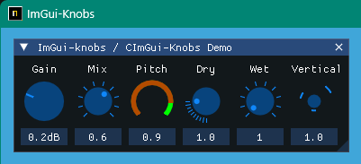
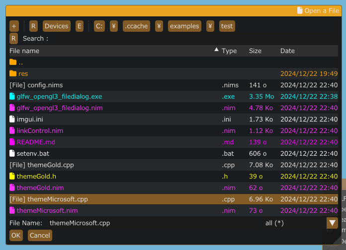

<!-- START doctoc generated TOC please keep comment here to allow auto update -->
<!-- DON'T EDIT THIS SECTION, INSTEAD RE-RUN doctoc TO UPDATE -->

- [ImGuin](#imguin)
  - [Usage: Sample program and run](#usage-sample-program-and-run)
    - [Prerequisites](#prerequisites)
    - [Install](#install)
    - [Build examples](#build-examples)
    - [Available libraries](#available-libraries)
    - [Screen shot (examples)](#screen-shot-examples)
      - [glfw_opengl3](#glfw_opengl3)
      - [glfw_opengl3_imknobs](#glfw_opengl3_imknobs)
      - [glfw_opengl3_filedialog](#glfw_opengl3_filedialog)
      - [glfw_opengl3_iconfont_viewer](#glfw_opengl3_iconfont_viewer)
      - [glfw_opengl3_image_load / sdl2_opengl3  / sdl3_opengl3](#glfw_opengl3_image_load--sdl2_opengl3---sdl3_opengl3)
      - [glfw_opengl3_image_save](#glfw_opengl3_image_save)
      - [glfw_opengl3_jp](#glfw_opengl3_jp)
      - [glfw_opengl3_implot](#glfw_opengl3_implot)
      - [glfw_opengl3_imnodes](#glfw_opengl3_imnodes)
      - [glfw_opengl3_imguizmo](#glfw_opengl3_imguizmo)
      - [My test app movie using imguin](#my-test-app-movie-using-imguin)
  - [Cross compilation: Generating Windows application binary(\*.exe) on Linux OS](#cross-compilation-generating-windows-application-binary%5Cexe-on-linux-os)
  - [Update / Downgrade Dear ImGui and CImGui](#update--downgrade-dear-imgui-and-cimgui)
    - [Prerequisite](#prerequisite)
    - [Update / Downgrade  ImGui/CImGui](#update--downgrade--imguicimgui)
  - [Selection backend compiler](#selection-backend-compiler)
  - [TODO](#todo)
  - [Compressing binary file](#compressing-binary-file)
  - [My tools version](#my-tools-version)
  - [Other link](#other-link)
      - [Similar project ImGui / CImGui](#similar-project-imgui--cimgui)
      - [SDL Game tutorial Platfromer](#sdl-game-tutorial-platfromer)
      - [Other link2](#other-link2)

<!-- END doctoc generated TOC please keep comment here to allow auto update -->

# ImGuin


Updated to latest ImGui/CImGui version: : **v1.91.6dock** (2024/12)

This project is my experiment project to use Nim language, ImGui, ImPlot, futhark and etc.  

- Notice  
It may be better to use the **mainstream** project [nimgl/imgui](https://github.com/nimgl/imgui) (ImGui v1.85)  
,updated project [nimgl-imgui](https://github.com/dinau/nimgl-imgui) (ImGui v1.89.9)
,sub project [nim_implot](https://github.com/dinau/nim_implot) and test project [nimgl_test](https://github.com/dinau/nimgl_test).


## Usage: Sample program and run

---

### Prerequisites

---

- [Nim-2.0.14](https://nim-lang.org) or later
- Windows10 or later  
[MSys2/MinGW](https://www.msys2.org/) command line tools (Unix tools), make, cp, rm, git, ...etc
- Linux Mint 22 (or Ubuntu / Debian families ?)

  ```sh
  $ sudo apt install xorg-dev libopengl-dev libgl1-mesa-dev
  ```

  and for glfw3 and sdl2,

  ```sh
  $ sudo apt install libglfw3 libglfw3-dev
  $ sudo apt install libsdl2-dev
  ```

### Install

---

```sh
nimble uninstall imguin  # Remove old versions if exists. 
nimble install https://github.com/dinau/imguin
```

### Build examples

---

1. First clone this project,

   ```sh
   git clone https://github.com/dinau/imguin
   ```

1. Sample program is here, [examples](examples).
For instance [glfw_opengl3.nim](examples/glfw_opengl3/glfw_opengl3.nim),

   ```sh
   cd imguin/examples/glfw_opengl3
   make  # or make run
   ```

   After build, run `./glfw_opengl3(.exe)`  
   Compiation options depend on `./config.nims` and `./Makefile`.


1. For selecting static link or dynamic link ,read this [examples/README.md](examples/README.md).

### Available libraries 

---

|     | Library name                                                                                                        |              |
|-----|---------------------------------------------------------------------------------------------------------------------|--------------|
| v   | ImGui / CImGui                                                                                                      | Base library |
| v   | ImPlot / CImPlot                                                                                                    |
| v   | ImNodes/ CImNodes                                                                                                   |
| v   | ImGuizmo/ CImGuizmo                                                                                                 |
| v   | ImGui-Knobs/ CImGui-Knobs                                                                                           |
| v   | ImGuiFileDialog / [CImGuiFileDialog](https://github.com/dinau/CImGuiFileDialog)                                     | Windows      |
| ... | ...                                                                                                                 | ...          |
| x   | [ImGuiColorTextEdit](https://github.com/BalazsJako/ImGuiColorTextEdit) / [cimCTE](https://github.com/cimgui/cimCTE) | 2025 ?       |

### Screen shot (examples)

---

These screen shots are on Windows10.

#### [glfw_opengl3](examples/glfw_opengl3)  

---

Basic example with icon fonts


- Build

   ```sh
   pwd
   examples/glfw_opengl3
   make        # or make run
   ```

   or 

   ```sh
   nim c glfw_opengl3.nim    # or  nim c -r glfw_opengl3.nim   or   nim r glfw_opengl3.nim 
   ```


#### [glfw_opengl3_imknobs](examples/glfw_opengl3_imknobs)

---

[https://github.com/altschuler/imgui-knobs](https://github.com/altschuler/imgui-knobs)  


[cimgui-knobs](src/imguin/private/cimgui-knobs) sources have been contributed from [system64MC](https://github.com/system64MC) / [PR](https://github.com/dinau/imguin/commits?author=system64MC) (2024/12).  Thank you.




- Build

   ```sh
   pwd
   examples/glfw_opengl3_imknobs
   make 
   ```
   or 

   ```sh
   nim c -d:ImKnobsEnable --warning:HoleEnumConv:off glfw_opengl3_imknobs.nim  
   ```

#### [glfw_opengl3_filedialog](examples/glfw_opengl3_filedialog)

---

[ImGuiFileDialog](https://github.com/aiekick/ImGuiFileDialog) / [CImGuiFileDialog](https://github.com/dinau/CImGuiFileDialog)   



- Build

   ```sh
   pwd
   examples/glfw_opengl3_filedialog
   make 
   ```

   or 

   ```sh
   nim c -d:ImGuiFileDialogEnable  glfw_opengl3_filedialog.nim  
   ```

#### [glfw_opengl3_iconfont_viewer](examples/glfw_opengl3_iconfont_viewer)  

---

Icon font viewer and magnifying glass


- Build

   ```sh
   pwd
   examples/iconFontViewer
   make 
   ```

   or 

   ```sh
   nim c iconFontViewer.nim  
   ```

#### [glfw_opengl3_image_load](examples/glfw_opengl3_image_load) / [sdl2_opengl3](examples/sdl2_opengl3)  / [sdl3_opengl3](examples/sdl3_opengl3) 

---

Image load and magnifying glass


- Build

   ```sh
   pwd
   examples/glfw_opengl3_image_load
   make 
   ```

   or 

   ```sh
   nim c glfw_opengl3_image_load.nim  
   ```

- Build sdl2 version

   ```sh
   pwd
   examples/sdl2_opengl3
   make 
   ```

   or 

   ```sh
   nim c -d:SDL sdl2_opengl3.nim  
   ```

- Build sdl3 version  
Only windows OS at this moment and WIP.

   ```sh
   pwd
   examples/sdl3_opengl3
   make 
   ```

   or 

   ```sh
   nim c -d:SDL sdl3_opengl3.nim  
   ```

#### [glfw_opengl3_image_save](examples/glfw_opengl3_image_save)  

---

Image load / save  and magnifying glass  
It can save a screen shot as [ jpg, bmp, png or tga ] file.


- Build

   ```sh
   pwd
   examples/glfw_opengl3_image_save
   make        # or make run
   ```
   
   or 

   ```sh
   nim c glfw_opengl3_image_save.nim
   ```

#### [glfw_opengl3_jp](examples/glfw_opengl3_jp)

---

Showing UTF-8 text and input text with a local country language.  


- Build

   ```sh
   pwd
   examples/glfw_opengl3_jp
   make        # or make run
   ```
   
   or 

   ```sh
   nim c glfw_opengl3_jp.nim
   ```

#### [glfw_opengl3_implot](examples/glfw_opengl3_implot)

---

Showing ImGui demo with ImPlot demo.  
  

- Build

   ```sh
   pwd
   examples/glfw_opengl3_implot
   make        # or make run
   ```
   
   or 

   ```sh
   nim c -d:ImPlotEnable glfw_opengl3_implot.nim
   ```

#### [glfw_opengl3_imnodes](examples/glfw_opengl3_imnodes)

---

  
- Build

   ```sh
   pwd
   examples/glfw_opengl3_imnodes
   make        # or make run
   ```
   
   or 

   ```sh
   nim c -d:ImNodesEnable glfw_opengl3_imnodes.nim
   ```

#### [glfw_opengl3_imguizmo](examples/glfw_opengl3_imguizmo)

---

  
- Build

   ```sh
   pwd
   examples/glfw_opengl3_imguizmo
   make        # or make run
   ```
   
   or 

   ```sh
   nim c -d:ImGuizmoEnable glfw_opengl3_imguizmo.nim
   ```

####  My test app movie using imguin

---

[](https://youtu.be/Ea0t7b9Kmq4)

## Cross compilation: Generating Windows application binary(\*.exe) on Linux OS

---

See:  
[Cross compilation to Windows, linker error (unrecognized option '-z'](https://forum.nim-lang.org/t/11302#73838)  
https://nim-lang.org/docs/nimc.html#crossminuscompilation-for-windows

For example on Linux Mint 22 and so on,

```sh
pwd
examples
cd glfw_opengl3
```

```sh
make win  
```

or

```sh
nim c -d:mingw glfw_opengl3
```
or 

```sh
nim c --os:windows glfw_opengl3
```


`glfw_opengl3.exe` will be generated in the current folder.

## Update / Downgrade Dear ImGui and CImGui

### Prerequisite

---

1. [Git](https://git-scm.com/) installed.
1. Installed MSys2/MinGW command line tools (Unix tools), make, cp, rm, ...etc
1. Windows10 or later
Clang/LLVM refer to [Futhark installation](https://github.com/PMunch/futhark#installation).

   ```sh
   nimble install futhark
   ```

   It must exist `libclang.a` file in the library path (e.g. in `c:\llvm\lib`).

1. Linux Debian 12 Bookworm

    ```sh
    sudo apt install  clang-16
    nimble install --passL:"-L/usr/lib/llvm-16/lib" futhark
    ```

Important Notice: Confirm Futhark version is **v0.13.6** at this time. (2024/09)

```sh
nimble dump futhark

name: "futhark"
version: "0.13.6"
author: "PMunch"
desc: "A package which uses libclang to parse C headers into Nim files for easy interop"
license: "MIT"
...
```

### Update / Downgrade  ImGui/CImGui

---
1. Compose development folders  
First move to your working folder you like, then

   ```sh
   mkdir imguin_dev
   cd imguin_dev
   git clone https://github.com/dinau/imguin
   cd imguin
   ```

1. Clone ImGui/CImGui etc. sources at once forever  

   ```sh
   pwd
   imguin
   make clonelibs
   ```

   Cloned libraries are under `../libs/` folder
1. **Recursively** update the sources using git `Pull` or `fetch` command in the each library folder,  
   ../libs/cimgui  
   ../libs/cimguizmo  
   ../libs/cimnodes  
   ../libs/cimplot  
1.  Checkout arbitrary version with git command in the respective folder

1. Specify your `Clang` include path to  `ClangIncludePath` in `imguin/src/imguin/cimgui.nim`.

1. Generate [the definition file](src/imguin/cimgui_defs.nim) uisng [Futhark](https://github.com/PMunch/futhark),  

   ```sh
   pwd
   imguin
   make gen
   ```

1. Install updated files  
Properly edit the version info etc in `imguin.nimble` file, then

   ```sh
   pwd
   imguin
   nimble uninstall imguin  # Remove old versions if it exists. 
   nimble install 
   ```

   That's all.  
   Repeat from `3.` if you'd like to update or downgrade to other version.


- Confirmed version

  | ImGui/CImGui Ver. | ImGuin Ver. | Date    | WindowsOS | Linux Mint 22 | Debian<br> Bookworm (1) |
  | :--------------:  | ---------   | :----:  | :---:     | :---:         | :---:                   |
  | 1.91.6dock        | 1.91.6.3    | 2024/12 | OK        | OK            | -                       |
  | 1.91.5dock        | -           | -       | -         | -             | -                       |
  | 1.91.4dock        | 1.91.4.2    | 2024/12 | OK        | OK            | -                       |
  | 1.91.3dock        | 1.91.3.1    | 2024/10 | OK        | (7)           | -                       |
  | 1.91.2dock        | 1.91.2.0    | 2024/10 | OK        | (7)           | -                       |
  | 1.91.1dock        | 1.91.1.2    | 2024/09 | OK        | (6)           | -                       |
  | 1.91.0dock        | 1.91.0.0    | 2024/08 | OK        | -             | (7)                     |
  | 1.90.4dock        | 1.90.4.2    | 2024/02 | OK        | -             | OK (4)                  |
  | 1.90.1dock        | 1.90.1.0    | 2024/01 | OK        | -             | NG/OK(1)(3)(4)          |
  | 1.89.9dock        | 1.89.9.8    | 2023/12 | OK        | -             | NG/OK(1)(3)(4)          |

  (1): Except imnodes and SDL2 example.  
  (2): Doesn't work well.  
  (3): Works well only if it is compiled debug mode.  
  (4): Use nim-2.0.2  
  (5): I don't know why can't be compiled on Linux.  
  (6): OK: Except ImNodes example  
  (7): Not checked at this moment.


## Selection backend compiler

---

You might be able to use another C/C++ compiler,  
`Clang, vcc(Visual Studio C/C++) , zig cc`  
by changing variable `TC` in [examples/config.nims.common](examples/config.nims.common).

## TODO

---

1. ~~Whether can it use `cimgui.dll` ? (Now it can only be static link)~~ Closed. Only be static link.
1. ~~Easier compilation for SDL2 app~~. (2024/09) Done.
1. ~~Added: ImNodes/CImNodes~~ (2023/10) Done
1. ~~Unfortunately ImGui 1.89.7 dosn't work well at this moment.(2023/07)~~ Done. (2023/08)
1. ~~Whether can it do `nimble install imguin` ?~~ [Done (2023/09) (#Issue 13)](https://github.com/dinau/imguin/issues/13)
1. ~~Add Font Awesome (Icon Font) demo.~~  Done (2023/04).
1. ~~Can it compile with MSVC (--cc:vcc) ?~~ Done. Except SDL2 demo. (2023/03), TODO (2024/09)
1. ~~Can it compile with Clang (--cc:clang) ?~~ Done. (2023/03)
1. ~~Add SDL2 example.~~ Done. [examples/sdl2_opengl3](examples/sdl2_opengl3) (2023/03)
- First step is done. (2023/03)

## Compressing binary file

---

Install `UPX` with MSys console on WindowsOS,


```sh
pacman -S mingw-w64-x86_64-upx
```

For compression exe file,

```sh
pwd
examples
cd glfw_opengl3_implot
make upx
```

```sh
                       Ultimate Packer for eXecutables
                          Copyright (C) 1996 - 2024
UPX 4.2.4       Markus Oberhumer, Laszlo Molnar & John Reiser    May 9th 2024

        File size         Ratio      Format      Name
   --------------------   ------   -----------   -----------
   7117824 ->   1217024   17.10%    win64/pe     glfw_opengl3_implot.exe      
```

Decompressing,

```sh
make dupx
```

Result in,

|                         |          GCC + UPX :  GCC |      Clang + UPX : Clang | MSVC(vcc) + UPX : MSVC    |
|------------------------:|--------------------------:|-------------------------:|--------------------------:|
|        glfw_opengl3.exe |          804 KB : 2360 KB |         720 KB : 2200 KB | 742 KB : 2070 KB          |
| glfw_opengl3_implot.exe | **1220 KB** : **7120 KB** | **940KB**  : **4200 KB** | **945 KB**  : **3810 KB** |

GCC: v14.2.0, Clang: v18.1.8, MSVC: 2022

## My tools version

---

Windows11 (main)
- **Nim Compiler Version 2.2.0**
- **GCC (Rev1, Built by MSYS2 project) 14.2.0**

   ```sh
   pacman -S mingw-w64-ucrt-x86_64-gcc
   ```

- Clang version 19.1.6

   ```sh
   pacman -S mingw-w64-ucrt-x86_64-clang
   ```
- Visual Studio C++/C 2022
- git version 2.46.0.windows.1
- SDL2.dll: 2.30.7
- Make: GNU Make 4.4.1
- MSys2/MinGW tools

Linux Mint 22
- **Nim Compiler Version 2.2.0**
- gcc 13.2.0
- SDL2: 2.30.0
- make: GNU Make 4.3
- git version 2.43.0


## Other link

---

- File Dialog
   - [Cross Platform File Dialog for Dear-ImGui ](https://github.com/gallickgunner/ImGui-Addons)
   - [ImGui File Dialogs - CLI and Client Library](https://github.com/time-killer-games/libfiledialogs)
   - [A Dear ImGui based File Dialog without any extra dependencies](https://github.com/Julianiolo/ImGuiFD)
- Other
   - [Node Editor built using Dear ImGui](https://github.com/thedmd/imgui-node-editor)
- GUI
   - [nuklear-nim (Public archived)](https://github.com/zacharycarter/nuklear-nim)

- Graphical
  - [Immediate Mode Plotting](https://github.com/epezent/implot)
     


#### Similar project ImGui / CImGui

---

| Language             |          | Project                                                                                                                                         |
| -------------------: | :---:    | :----------------------------------------------------------------:                                                                              |
| **Nim**              | Compiler | [ImGuin](https://github.com/dinau/imguin), [Nimgl_test](https://github.com/dinau/nimgl_test), [Nim_implot](https://github.com/dinau/nim_implot) |
| **Lua**              | Script   | [LuaJITImGui](https://github.com/dinau/luajitImGui)                                                                                             |
| **Zig**, C lang.     | Compiler | [Dear_Bindings_Build](https://github.com/dinau/dear_bindings_build)                                                                             |
| **Zig**              | Compiler | [ImGuinZ](https://github.com/dinau/imguinz)                                                                                                     |
| **NeLua**            | Compiler | [NeLuaImGui](https://github.com/dinau/neluaImGui)                                                                                               |
| **Python**           | Script   | [DearPyGui for 32bit WindowsOS Binary](https://github.com/dinau/DearPyGui32/tree/win32)                                                         |

#### SDL Game tutorial Platfromer

---


| Language             |          | Project                                                                                                  |
| -------------------: | :---:    | :----------------------------------------------------------------:                                       |
| **Nim**              | Compiler | [Nim-Platformer](https://github.com/dinau/nim-platformer)/ [sdl3_nim](https://github.com/dinau/sdl3_nim) |
| **LuaJIT**           | Script   | [LuaJIT-Platformer](https://github.com/dinau/luajit-platformer)                                          |
| **Nelua**            | Compiler | [NeLua-Platformer](https://github.com/dinau/nelua-platformer)                                            |
| **Zig**              | Compiler | [Zig-Platformer](https://github.com/dinau/zig-platformer)                                                |


#### Other link2

---

- https://github.com/SpartanJ/SOIL2  
SOIL2 is a tiny C library used primarily for uploading textures into OpenGL. 
