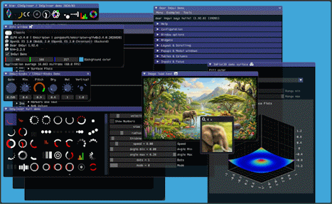
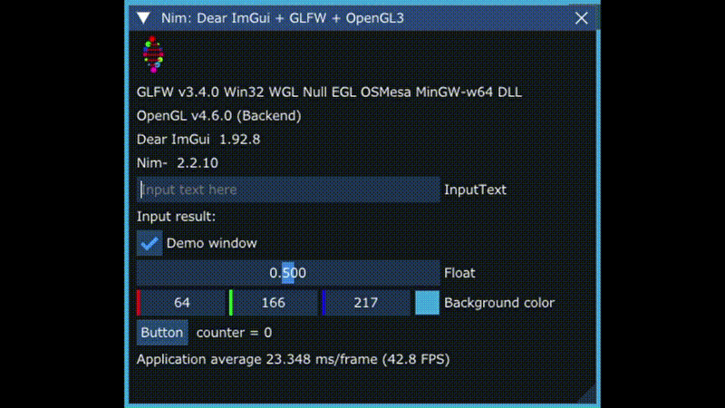

# ImGuin

ImGuin is a Nim wrapper[^nimgl_note] for [Dear ImGui](https://github.com/ocornut/imgui) through
[CImGui](https://github.com/cimgui/cimgui). It bundles Nim bindings and build
support for Dear ImGui and several popular Dear ImGui extensions.

Current bundled Dear ImGui / CImGui version: **v1.92.8 dock**  
Current ImGuin package version: **1.92.8.0**  
Updated: **2026/06**

[^nimgl_note]: Depending on your project requirements, the mainstream
[nimgl/imgui](https://github.com/nimgl/imgui) project or related Nim ImGui
packages may also be worth checking. See [Related Projects](#related-projects).

## Contents

- [Demo](#demo)
- [Features](#features)
- [Requirements](#requirements)
- [Install](#install)
- [Quick Start](#quick-start)
- [Supported Frontends and Backends](#supported-frontends-and-backends)
- [Bundled Libraries](#bundled-libraries)
- [Examples](#examples)
- [Development](#development)
- [Version Compatibility](#version-compatibility)
- [Tool Versions](#tool-versions)
- [Related Projects](#related-projects)
- [Notes](#notes)

## Demo

Try the WebAssembly demo in your browser:
[glfw_opengl3_wasm_base](https://dinau.github.io/imguin/wasm/demo/glfw_opengl3_wasm_base.html)



Source and build notes:
[Wasm example: glfw_opengl3_wasm_base](https://github.com/dinau/imguin_examples#wasm-example-glfw_opengl3_wasm_base)

## Features

- Dear ImGui bindings for Nim, generated with Futhark.
- Static-link focused C/C++ library integration.
- GLFW, SDL2, SDL3, Vulkan, OpenGL3, SDL renderer, SDL GPU, and WebAssembly examples.
- Bundled wrappers for ImPlot, ImNodes, ImGuizmo, ImGuiFileDialog, ImPlot3D, and more.
- [Simple test application](tests/tglfw_opengl3.nim) available through `nimble test` or `nimble make`.

## Requirements

### Nim

- [Nim](https://nim-lang.org) **2.2.4 or later**

### Windows

- Windows 11 or later is recommended.
- [MSYS2 / MinGW](https://www.msys2.org/) command-line tools.
- `make`, `cp`, `rm`, `git`, and related Unix-style tools.

Install GLFW for the UCRT64 environment:

```sh
pacman -S mingw-w64-ucrt-x86_64-glfw make
```

### Linux

Ubuntu / Debian family distributions are tested most often.

```sh
sudo apt install gcc g++ make git curl xz-utils
sudo apt install libopengl-dev libgl1-mesa-dev libglfw3-dev \
  libxcursor-dev libxinerama-dev libxi-dev libsdl2-dev
```

Install Nim with `choosenim` if Nim is not already installed:

```sh
curl https://nim-lang.org/choosenim/init.sh -sSf | sh
```

Make sure the Nimble binary directory is available in your `PATH`, for example:

```sh
export PATH="$HOME/.nimble/bin:$PATH"
```

## Install

```sh
nimble refresh
nimble uninstall imguin
nimble install imguin
```

If you are installing from a local checkout:

```sh
pwd
imguin
nimble install
```

## Quick Start

Run the default GLFW + OpenGL3 test application:

```sh
nimble test
```

Build the same test application without running it:

```sh
nimble make
```

The main test source is:
[tests/tglfw_opengl3.nim](https://github.com/dinau/imguin/blob/main/tests/tglfw_opengl3.nim)



## Supported Frontends and Backends

| Frontend | Backends |
| --- | --- |
| GLFW | OpenGL3, Vulkan (2026/03) |
| SDL2 | OpenGL3, SDL_Renderer2 |
| SDL3 | OpenGL3, SDL_Renderer3, SDL_GPU3, Vulkan (2026/03) |
| WASM | WebGL 2.0 (2026/04) |

## Bundled Libraries

| Status | Library | C wrapper / integration |
| --- | --- | --- |
| Done | [Dear ImGui](https://github.com/ocornut/imgui) | [CImGui](https://github.com/cimgui/cimgui) |
| Done | [ImPlot](https://github.com/epezent/implot) | [CImPlot](https://github.com/cimgui/cimplot) |
| Done | [ImNodes](https://github.com/Nelarius/imnodes) | [CImNodes](https://github.com/cimgui/cimnodes) |
| Done | [ImGuizmo](https://github.com/CedricGuillemet/ImGuizmo) | [CImGuizmo](https://github.com/cimgui/cimguizmo) |
| Done | [ImGui-Knobs](https://github.com/altschuler/imgui-knobs) | [CImGui-Knobs](https://github.com/dinau/imguin/tree/main/src/imguin/private/cimgui-knobs) |
| Done | [ImGuiFileDialog](https://github.com/aiekick/ImGuiFileDialog) | [CImGuiFileDialog](https://github.com/dinau/CImGuiFileDialog) |
| Done | [ImGui_Toggle](https://github.com/cmdwtf/imgui_toggle) | [CImGui_Toggle](https://github.com/dinau/cimgui_toggle) |
| Done | [ImPlot3D](https://github.com/brenocq/implot3d) | [CImPlot3D](https://github.com/cimgui/cimplot3d) |
| Done | [ImSpinner](https://github.com/dalerank/imspinner) | Built from source |
| Done | [ImGuiColorTextEdit](https://github.com/santaclose/ImGuiColorTextEdit) | [cimCTE](https://github.com/cimgui/cimCTE), 2025/03 |
| Done | [ImGuiTextSelect](https://github.com/AidanSun05/ImGuiTextSelect) | [CImGuiTextSelect](https://github.com/dinau/CImGuiTextSelect), 2025/09 |
| Done | [imgui_zoomable_image](https://github.com/danielm5/imgui_zoomable_image) | [cimgui_zoomable_image](https://github.com/dinau/cimgui_zoomable_image), 2026/04 |
| WIP | [ImGui_Markdown](https://github.com/enkisoftware/imgui_markdown) | Planned, 2025/09 |

Additional libraries and assets:

- [stb](https://github.com/nothings/stb)
- [Font Awesome](https://github.com/FortAwesome/Font-Awesome)
- [Naylib](https://github.com/planetis-m/naylib) / [Raylib](https://github.com/raysan5/raylib) with [rlImGui](https://github.com/raylib-extras/rlImGui)

## Examples

The main example repository is
[ImGuin examples](https://github.com/dinau/imguin_examples).

### GLFW + OpenGL3

```sh
nimble test
```

### Dear ImGui + Naylib / Raylib + rlImGui

[rlimgui_basic example](https://github.com/dinau/imguin_examples#rlimgui_basic-naylib--Raylib--rlimgui)


## Development

The repository includes scripts for updating or downgrading the bundled Dear ImGui,
CImGui, and extension sources. These steps are intended for package maintainers.

### Futhark Setup

Install Futhark:

```sh
nimble install futhark
```

Confirm the installed Futhark version:

```sh
nimble dump futhark
```

The currently expected Futhark version is **v0.16.0**.

#### Windows

Install Clang / LLVM. See the
[Futhark installation guide](https://github.com/PMunch/futhark#installation).

`libclang.a` must be available in the library path, for example:

- `c:\llvm\lib`
- `c:\msys64\ucrt64\bin`

#### Linux

For Debian / Ubuntu family distributions:

```sh
sudo apt install libclang-19-dev
nimble install --passL:"-L/usr/lib/llvm-19" futhark
```

### Update Bundled Sources

Clone this repository into a development workspace:

```sh
mkdir imguin_dev
cd imguin_dev
git clone https://github.com/dinau/imguin
cd imguin
```

Clone the upstream C/C++ libraries:

```sh
make clonelibs
```

The external libraries are cloned under `../libs/`.

Update or checkout each library version as needed, for example:

- `../libs/cimgui`
- `../libs/cimguizmo`
- `../libs/cimnodes`
- `../libs/cimplot`

Then regenerate the Nim definitions:

```sh
make gen
```

If needed, update the version metadata in `imguin.nimble`, then install the local
package:

```sh
nimble uninstall imguin
nimble install
```

Repeat the update, checkout, and `make gen` steps when moving to another upstream
version.

## Version Compatibility

Windows builds are confirmed unless otherwise noted.

| ImGui / CImGui | ImGuin | Date | Linux Debian family | Notes |
| :---: | --- | :---: | :---: | --- |
| 1.92.8 dock | 1.92.8.0 | 2026/06 | OK | |
| 1.92.7 dock | 1.92.7.0 | 2026/04 | OK | |
| 1.92.6 dock | 1.92.6.2 | 2026/03 | OK | Added Wasm function |
| 1.92.6 dock | 1.92.6.1 | 2026/03 | OK | Breaking change in `impl_glfw.nim` |
| 1.92.6 dock | 1.92.6.0 | 2026/02 | OK | |
| 1.92.4 dock | 1.92.4.0 | 2025/11 | OK | |
| 1.92.3 dock | 1.92.3.0 | 2025/09 | OK | |
| 1.92.2b dock | 1.92.2.1 | 2025/09 | OK | |
| 1.92.2b dock | 1.92.2.0 | 2025/08 | OK | |
| 1.92.0 dock | 1.92.0.2 | 2025/08 | OK | |
| 1.92.0 dock | 1.92.0.1 | 2025/07 | OK | |
| 1.91.9b dock | 1.91.9.4 | 2025/06 | OK | |
| 1.91.8 dock | 1.91.8.2 | 2025/03 | OK | |
| 1.91.6 dock | 1.91.6.15 | 2025/01 | Not checked | Probably works |
| 1.91.4 dock | 1.91.4.2 | 2024/12 | OK | |
| 1.91.3 dock | 1.91.3.1 | 2024/10 | Not checked | Probably works |
| 1.91.2 dock | 1.91.2.0 | 2024/10 | Not checked | Probably works |
| 1.91.1 dock | 1.91.1.2 | 2024/09 | Partial | Except ImNodes example |
| 1.91.0 dock | 1.91.0.0 | 2024/08 | Not checked | Probably works |
| 1.90.4 dock | 1.90.4.2 | 2024/02 | Use Nim 2.0.2 | |
| 1.89.9 dock | 1.89.9.8 | 2023/12 | Partial | Except ImNodes and SDL2 examples; works best in debug mode |

## My Tool Versions

### Windows 11

- Nim Compiler Version 2.2.10
- GCC 16.1.0, MSYS2 build
- Visual Studio C++/C 2022
- Git 2.46.0.windows.1
- GNU Make 4.4.1
- MSYS2 / MinGW-UCRT tools

### Linux Debian 13

- Nim Compiler Version 2.2.6
- GCC 14.2.0
- GNU Make 4.4.1

## Related Projects

### Nim / ImGui

- [nimgl/imgui](https://github.com/nimgl/imgui)
- [nimgl-imgui](https://github.com/dinau/nimgl-imgui)
- [nim_implot](https://github.com/dinau/nim_implot)
- [nimgl_test](https://github.com/dinau/nimgl_test)
- [daniel-j/nimgl-imgui](https://github.com/daniel-j/nimgl-imgui)

### Similar ImGui / CImGui Projects

| Language | Type | Project |
| ---: | :---: | --- |
| Lua | Script | [LuaJITImGui](https://github.com/dinau/luajitImGui) |
| NeLua | Compiler | [NeLuaImGui](https://github.com/dinau/neluaImGui), [NeLuaImGui2](https://github.com/dinau/neluaImGui2) |
| Nim | Compiler | [ImGuin](https://github.com/dinau/imguin), [Nimgl_test](https://github.com/dinau/nimgl_test), [Nim_implot](https://github.com/dinau/nim_implot) |
| Python | Script | [DearPyGui for 32-bit Windows binary](https://github.com/dinau/DearPyGui32/tree/win32) |
| Ruby | Script | [igRuby examples](https://github.com/dinau/igruby_examples) |
| Zig | Compiler | [ImGuinz](https://github.com/dinau/imguinz) / [ImGuinz2](https://github.com/dinau/imguinz2) |

### File Dialogs

- [Cross Platform File Dialog for Dear ImGui](https://github.com/gallickgunner/ImGui-Addons)
- [SDL2 ImGui File Dialogs](https://github.com/samuelvenable/SDL2-ImGui-FileDialogs)
- [SDL3 ImGui File Dialogs](https://github.com/samuelvenable/SDL3-ImGui-FileDialogs)
- [Dear ImGui file dialog without extra dependencies](https://github.com/Julianiolo/ImGuiFD)

### Other UI / Graphics Links

- [Node Editor built using Dear ImGui](https://github.com/thedmd/imgui-node-editor)
- [nuklear-nim](https://github.com/zacharycarter/nuklear-nim) (archived)
- [Immediate Mode Plotting](https://github.com/epezent/implot)
- [SOIL2](https://github.com/SpartanJ/SOIL2)


### SDL Platformer Examples


| Language | Type | SDL | Project |
| ---: | :---: | :---: | --- |
| LuaJIT | Script | SDL2 | [LuaJIT-Platformer](https://github.com/dinau/luajit-platformer) |
| Nelua | Compiler | SDL2 | [NeLua-Platformer](https://github.com/dinau/nelua-platformer) |
| Nim | Compiler | SDL3 / SDL2 | [Nim-Platformer-sdl2](https://github.com/def-/nim-platformer), [Nim-Platformer-sdl3](https://github.com/dinau/sdl3_nim/tree/main/examples/platformer) |
| Ruby | Script | SDL3 | [Ruby-Platformer](https://github.com/dinau/ruby-platformer) |
| Zig | Compiler | SDL2 | [Zig-Platformer](https://github.com/dinau/zig-platformer) |

## Notes

### ImPlot / ImPlot3D

- This project builds and runs Dear ImGui, ImPlot, and ImPlot3D from Nim.
- ImPlot is compiled from source with `implot.h` and `implot.cpp`.
- ImPlot3D is compiled from source with `implot3d.h` and `implot3d.cpp`.

### Const CString Workaround

If you hit this C compiler warning:

```sh
error: assignment to 'char **' from incompatible pointer type 'const char * const*' [-Wincompatible-pointer-types]
```

This Nim declaration may help:

```nim
type ConstCstring {.importc: "const char *".} = cstring
```
