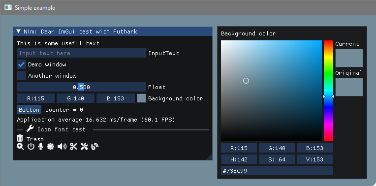

<!-- START doctoc generated TOC please keep comment here to allow auto update -->
<!-- DON'T EDIT THIS SECTION, INSTEAD RE-RUN doctoc TO UPDATE -->

- [ImGuin](#imguin)
  - [Usage: Sample program and run](#usage-sample-program-and-run)
    - [Prerequisites](#prerequisites)
    - [Install](#install)
    - [Build examples](#build-examples)
    - [Screen shot (examples)](#screen-shot-examples)
      - [glfw_opengl3](#glfw_opengl3)
      - [glfw_opengl3_image_load](#glfw_opengl3_image_load)
      - [glfw_opengl3_image_save](#glfw_opengl3_image_save)
      - [glfw_opengl3_nimgl_imguin_jp](#glfw_opengl3_nimgl_imguin_jp)
      - [glfw_opengl3_implot](#glfw_opengl3_implot)
      - [glfw_opengl3_imnodes](#glfw_opengl3_imnodes)
      - [glfw_opengl3_imguizmo](#glfw_opengl3_imguizmo)
      - [My test app movie using imguin](#my-test-app-movie-using-imguin)
  - [Update to latest Dear ImGui and CImGui](#update-to-latest-dear-imgui-and-cimgui)
    - [Prerequisite](#prerequisite)
    - [Update ImGui/CImGui](#update-imguicimgui)
  - [Selection backend compiler](#selection-backend-compiler)
  - [Examples notice](#examples-notice)
  - [TODO](#todo)
  - [My tools version](#my-tools-version)
  - [Other link](#other-link)
  - [Similar project](#similar-project)
  - [Star History](#star-history)

<!-- END doctoc generated TOC please keep comment here to allow auto update -->

# ImGuin


Updated to latest ImGui/CImGui version: : **v1.91.0dock** (2024/08)

This project is my experiment project to use Nim language, ImGui, ImPlot, futhark and etc.  

- Notice  
It may be better to use the **mainstream** project [nimgl/imgui](https://github.com/nimgl/imgui) (ImGui v1.85)  
,updated project [nimgl-imgui](https://github.com/dinau/nimgl-imgui) (ImGui v1.89.9)
,sub project [nim_implot](https://github.com/dinau/nim_implot) and test project [nimgl_test](https://github.com/dinau/nimgl_test).


## Usage: Sample program and run

---

### Prerequisites

---

- [Nim-2.0.2](https://nim-lang.org) or later (Windows10 or Debian Linux)
- MSys/MinGW command line tools (Unix tools), make, cp, rm, git, ...etc
- For Linux Debian 12 Bookworm,

  ```sh
  $ sudo apt install xorg-dev libopengl-dev libgl1-mesa-dev
  ```

  and for glfw3 and sdl2,

  ```sh
  $ sudo apt install libglfw3 libglfw3-dev
  $ sudo apt install libsdl2-dev
  ```

### Install

---

```sh
nimble uninstall imguin  # Remove old version if exists. 
nimble install https://github.com/dinau/imguin
```

### Build examples

---

1. First clone this project,

   ```sh
   git clone https://github.com/dinau/imguin
   ```

1. Sample program is here, [examples](examples).
For instance [glfw_opengl3.nim](examples/glfw_opengl3/glfw_opengl3.nim),

   ```sh
   cd imguin/examples/glfw_opengl3
   make  # or make run
   ```

   After build, run `./glfw_opengl3(.exe)`

1. For selecting static link or dynamic link ,read this [examples/README.md](examples/README.md).

### Screen shot (examples)

---

These screen shots are on Windows10.

#### [glfw_opengl3](examples/glfw_opengl3)  



#### [glfw_opengl3_image_load](examples/glfw_opengl3_image_load)  


#### [glfw_opengl3_image_save](examples/glfw_opengl3_image_save)  


#### [glfw_opengl3_nimgl_imguin_jp](examples/glfw_opengl3_nimgl_imguin_jp)

Showing UTF-8 label text and input text with my local country language.  


#### [glfw_opengl3_implot](examples/glfw_opengl3_implot)

Showing ImGui demo with ImPlot demo.  
  


#### [glfw_opengl3_imnodes](examples/glfw_opengl3_imnodes)

  

#### [glfw_opengl3_imguizmo](examples/glfw_opengl3_imguizmo)

  

####  My test app movie using imguin

[](https://youtu.be/Ea0t7b9Kmq4)

## Update to latest Dear ImGui and CImGui

### Prerequisite

---

1. [Git](https://git-scm.com/) installed.
1. MSys/MinGW command line tools (Unix tools), make, cp, rm, ...etc
1. Windows10 or later
Clang/LLVM refer to [Futhark installation](https://github.com/PMunch/futhark#installation).

   ```sh
   nimble install --passL:"-Lc:\llvm\lib" futhark
   ```

   It must exist **libclang.a** file in the library path (e.g. "c:\llvm\lib").

1. Linux Debian 12 Bookworm

    ```sh
    sudo apt install  clang-16
    nimble install --passL:"-L/usr/lib/llvm-16/lib" futhark
    ```

Important Notice: Confirm Futhark version is **v0.13.2** at this time. (2024/06)

```sh
nimble dump futhark

name: "futhark"
version: "0.13.2"
author: "PMunch"
desc: "A package which uses libclang to parse C headers into Nim files for easy interop"
license: "MIT"
...
```

### Update ImGui/CImGui

---
1. Compose development folders  
First move to your working folder you like, then

   ```sh
   mkdir imguin_dev
   cd imguin_dev
   git clone https://github.com/dinau/imguin
   cd imguin
   ```

1. Clone ImGui/CImGui etc. sources at once forever  

   ```sh
   pwd
   imguin
   make clonelibs
   ```

   Cloned libraries to under `../libs/` folder.  
1.
   Checkout arbitrary version you like with git command at the each library folder,  
   ../libs/cimgui  
   ../libs/cimplot  
   ../libs/cimnodes  

1. Generate [the definition file](src/imguin/cimgui_defs.nim) uisng [Futhark](https://github.com/PMunch/futhark),  

   ```sh
   pwd
   imguin
   make gen
   ```

1. Install updated files  
Properly edit the version info etc in `imguin.nimble` file, then

   ```sh
   pwd
   imguin
   nimble uninstall imguin  # Remove old version if it exists. 
   nimble install 
   ```

   That's all.  
   Repeat from `3.` if you'd like to update or downgrade to other version.


- Confirmed version

  | ImGui/CImGui Ver. | ImguiN Ver. | Date    | Windows10 | Debian<br> Bookworm (1) |
  | :--------------:  | ---------   | :----:  | :---:     | :---:                   |
  | 1.91.0dock        | 1.91.0.1    | 2024/08 | ok        | No checked              |
  | ↑                | 1.91.0.0    | 2024/08 | ok        | No checked              |
  | 1.90.9dock        | 1.90.9.4    | 2024/07 | ok        | NG (5)                  |
  | ↑                | 1.90.9.3    | 2024/07 | ok        | NG (5)                  |
  | 1.90.8dock        | 1.90.8.1    | 2024/06 | ok        | NG (5)                  |
  | ↑                | 1.90.8.0    | 2024/06 | ok        | NG (5)                  |
  | 1.90.7dock        | 1.90.7.0    | 2024/05 | ok        | NG (5)                  |
  | 1.90.6dock        | 1.90.6.1    | 2024/05 | ok        | NG (5)                  |
  | 1.90.4dock        | 1.90.4.3    | 2024/04 | ok        | NG (5)                  |
  | -                 | -           | -       | -         | -                       |
  | ↑                | 1.90.4.2    | 2024/02 | ok        | OK (4)                  |
  | 1.90.1dock        | 1.90.1.0    | 2024/01 | ok        | NG/OK(1)(3)(4)          |
  | 1.89.9dock        | 1.89.9.8    | 2023/12 | ok        | NG/OK(1)(3)(4)          |

  Notice(1): Except imnodes and SDL2 example.  
  Notice(2): Doesn't work well.  
  Notice(3): Works well only if it is compiled debug mode.  
  Notice(4): Use nim-2.0.2  
  Notice(5): I don't know why can't be compiled on Lunux.  


## Selection backend compiler

---

You might be able to use another C/C++ compiler,  
`Clang, vcc(Visual Studio C/C++) , zig cc`  
by changing variable `TC` in [examples/config.nims.common](examples/config.nims.common).

## Examples notice

---
- [examples/sdl2_opengl3](examples/sdl2_opengl3)
   1. If you are on Windows OS **32bit**, you should get `SDL2.dll` for instance from [release-2.26.4](https://github.com/libsdl-org/SDL/releases/tag/release-2.26.4).
      1. Unzip [SDL2-2.26.4-win32-x86.zip](https://github.com/libsdl-org/SDL/releases/download/release-2.26.4/SDL2-2.26.4-win32-x86.zip)
      1. Copy SDL2.dll to [examples/sdl2_opengl3](examples/sdl2_opengl3) folder.
   1. On Windows OS, it needs dev tool to compile SDL2 app,
      [SDL2-devel-2.26.4-mingw.zip](https://github.com/libsdl-org/SDL/releases/download/release-2.26.4/SDL2-devel-2.26.4-mingw.zip)
      for instance "SDL.h","-lSDL2.dll" etc
      and change `src/imguin/sdl2_opengl.nim`

      ```nim
      {.passC:"-Id:/msys32/mingw32/include/SDL2".}
      {.passL:"-Ld:/msys32/mingw32/lib -lSDL2.dll".}
      ```

      you need to properly change the above folder name depending on your settings.
      See [src/imguin/sdl2_opengl.nim](src/imguin/sdl2_opengl.nim)

## TODO

---

1. Easier compilation for SDL2 app.
1. ~~Added: ImNodes/CImNodes~~ (2023/10)Done
1. Whether can it use `cimgui.dll` ? (Now it can only be static link)
1. ~~Unfortunately ImGui 1.89.7 dosn't work well at this moment.(2023/07)~~ Done. (2023/08)
1. ~~Whether can it do `nimble install imguin` ?~~ [Done (2023/09) (#Issue 13)](https://github.com/dinau/imguin/issues/13)
1. ~~Add Font Awesome (Icon Font) demo.~~  Done (2023/04).
1. ~~Can it compile with MSVC (--cc:vcc) ?~~ Done. Except SDL2 demo. (2023/03)
1. ~~Can it compile with Clang (--cc:clang) ?~~ Done. (2023/03)
1. ~~Add SDL2 example.~~ Done. [examples/sdl2_opengl3](examples/sdl2_opengl3) (2023/03)
- First step is done. (2023/03)

## My tools version

---

Windows10 (main)
- **Nim Compiler Version 2.0.8**
- **Gcc.exe (Rev3, Built by MSYS2 project) 14.1.0**
- ~~Gcc.exe (MinGW-W64...) 11.1.0 (Nim offical)~~
- Clang version 18.1.8
- git version 2.45.2.windows.3
- SDL2.dll: 2.30.3
- make: GNU Make 4.4.1
- MSys2/MinGW tools
- Microsoft Visual Studio C/C++ 2019
- Zig: 0.12.0 (clang version 17.0.6)

Debian 12 Bookworm
- Nim Compiler Version 2.0.4
- **Gcc (Debian 12.2.0-14) 12.2.0**
- Git version 2.39.2
- GNU Make 4.3
- SDL2 ver.2.26.5

## Other link

---

- File Dialog
   - [Cross Platform File Dialog for Dear-ImGui ](https://github.com/gallickgunner/ImGui-Addons)
   - [ImGui File Dialogs - CLI and Client Library](https://github.com/time-killer-games/libfiledialogs)
   - [A Dear ImGui based File Dialog without any extra dependencies](https://github.com/Julianiolo/ImGuiFD)
- Other
   - [Node Editor built using Dear ImGui](https://github.com/thedmd/imgui-node-editor)
- GUI
   - [nuklear-nim (Public archived)](https://github.com/zacharycarter/nuklear-nim)

- Graphical
  - [Immediate Mode Plotting](https://github.com/epezent/implot)
     

## Similar project

---

- Dear ImGui

| Language             | Binding             | Project                                                                                                                                         |
| -------------------: | :---                | :----------------------------------------------------------------:                                                                              |
| **Nim**              | CImGui/CImPlot      | [ImGuin](https://github.com/dinau/imguin), [Nimgl_test](https://github.com/dinau/nimgl_test), [Nim_implot](https://github.com/dinau/nim_implot) |
| **Lua**              | CImGui/CImPlot etc. | [LuaJITImGui](https://github.com/dinau/luajitimgui)                                                                                             |
| **Zig**, C lang.     | Dear bindings       | [Dear_Bindings_Build](https://github.com/dinau/dear_bindings_build)                                                                             |
| **Zig**              | CImGui/CImPlot      | [ImGuinZ](https://github.com/dinau/imguinz)                                                                                                     |
| **Python**           | ImGui direct        | [DearPyGui for 32bit WindowsOS Binary](https://github.com/dinau/DearPyGui32/tree/win32)                                                         |

## Star History

[](https://star-history.com/#dinau/imguin&Date)
